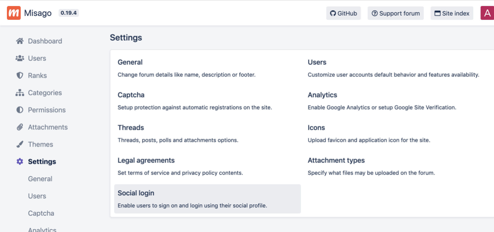
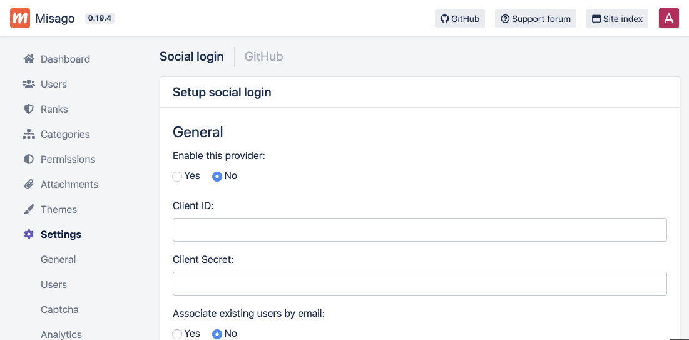

Social authentication
=====================

Misago can be configured to allow your users to join or sign in to your site using already-existing account in other service.

This feature is implemented using the [Python Social Auth](http://python-social-auth.readthedocs.io/en/latest/) library, so you should check it out to see which authentication providers are supported, how to customize social authentication in Misago or develop your own integration for your site.

In this guide we will only focus on providing example for making your Misago site allow users to join with GitHub as well as showing few additional configuration options that make process faster or more secure.

## Sign in with GitHub

### Configure your site on GitHub

Great majority of authentication providers require you to register your site as an "app" using their developer settings page.

Start by going to [Developer settings](https://github.com/settings/developers) page, and make sure you are in the "OAuth Apps" section. If you don't any apps yet, it will look like this:

Click the "Register a new application" button. This will move you to page where you will have to fill in details for your app:

Fill in following data:

**Application name** - this the name that will be displayed to users when GitHub will ask them if they want to share their account's data with your site.
**Homepage URL** - Url to your site's homepage.
**Authorization callback URL** - This is where GitHub will send user's data to after they confirm that they want to sign on your site. Unless you've customized your ``Python Social Auth`` links, entering same url as in "Homepage URL" will work.

Now click "Register application".

#### Note:

Different providers have different requirements for 3rd party apps. For example, Facebook Login requires app authors to meet following requirements to create app in Facebook for developers:

- Site is reachable from internet and uses ``https``
- You need to provide link to Privacy Policy used by your site
- Your callback URL needs to be explicit and contain `/complete/facebook/` in it to pass validation

To get start with GitHub, you don't have to meet any of those requirements. In fact, you can use `http://127.0.0.1:8000/` as callback URL and it will allow you to log in to Misago running on your computer, which makes it great for testing things out on your own.

### Client ID and secret

You should be redirected to page displaying your application name and settings:

You can return to this page any time by going to your [Developer settings](https://github.com/settings/developers) and clicking it on list of apps.

There are quite a few options here, but we are only interested in two:

- Client ID
- Client Secret

Those are the values that you will need to enter in your Misago ``settings.py`` in next step. It is **critical** that you don't make those values public and that you will not run Misago with ``DEBUG = True`` after you setup GitHub authentication because just going to non-existing page like `https://yoursite.com/dsjahkdhsajkh` will make Misago display its running settings and leak your Client ID and Secret, forcing you to generate new ones using "Reset client secret". If you don't do this, anybody will easily be able to pretend they are user coming from GitHub to join your site.

### Enabling GitHub authentication on Misago

Go to your forum's Admin Control Panel, click "Settings" in menu on the left, then navigate to "Social login".

You will see two lists: enabled login methods and "setup new login method". Find "GitHub" on the latter, and click on it.

"Setup social login" form will be displayed, enabling you to configure new admin method:

Copy the "Client ID" and "Client Secret" from GitHub into the form and change "Enable this provider" to "yes", then click the "Save changes" button.

"GitHub" method will now appear on the enabled methods list:

Finally, "Sign in with GitHub" option will display on login and registration forms:

