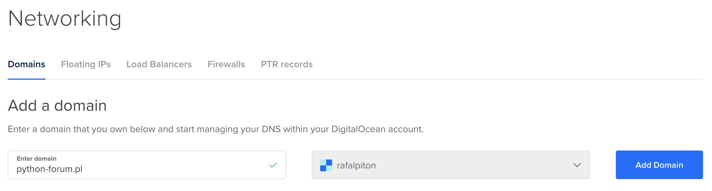
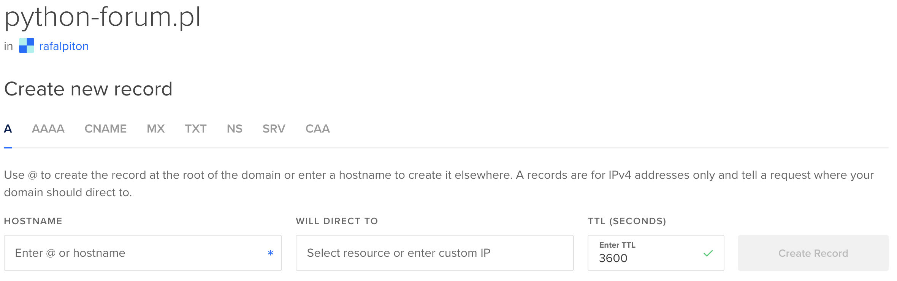
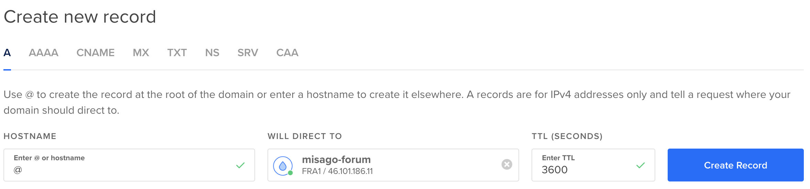
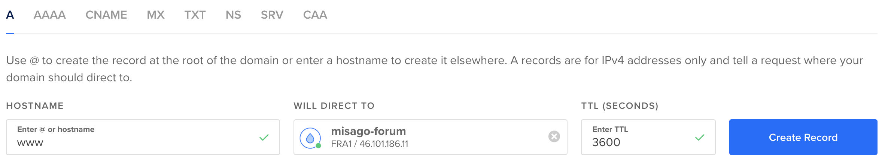
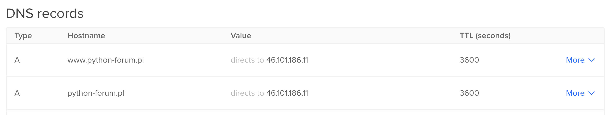
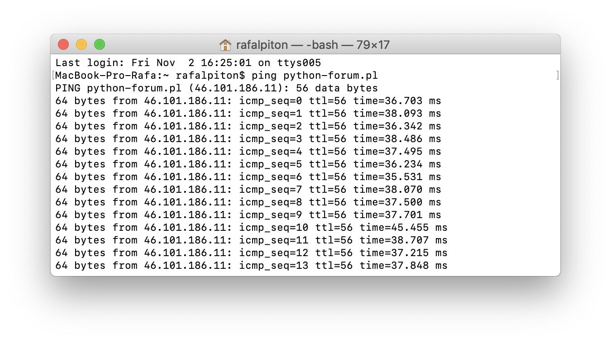

Point domain at your Digital Ocean server
=========================================

Now that you have a server that your Misago site will run on, you will also need to setup domain under which it will be accessible to your users.

Obtaining domain
----------------

You don't have to use Digital Ocean to buy domain for your site - any domain registrar will do.

When you have bought the domain, you should point ("delegate") it at Digital Ocean name servers (NS):

- ns1.digitalocean.com
- ns2.digitalocean.com
- ns3.digitalocean.com

Most domain registrars provide simple web panel to manage and point your domains, so we will not show any screenshots or details on how to do it.

Adding domain to Digital Ocean panel
------------------------------------

When you are finished, return Digital Ocean's cloud control panel and pick "Networking" from menu on the left. Here enter your domain in "Enter domain" field and confirm the action with "Add domain":

Pointing domain at server
-------------------------

After your domain name appears on "Domains" list, click it to go to the domain editor:

Make sure that "A" tab is active in the menu. Enter `@` into "HOSTNAME" field, and pick your droplet from "WILL DIRECT TO". Then click "Create Record"

Now repeat this action, but enter `www` in "HOSTNAME":

Two DNS records should not appear for your domain, one without www, and other with www:

Note: your DNS records list may include additional entries of "NS" type pointing your domain to "nsX.digitalocean.com." - this is okay.

Testing domain
--------------

On your computer open `terminal` (Linux, Mac, ect.) or `cmd.exe` (Windows) application, and run `ping` command followed with your domain name:

    ping mydomain.com

This will make your computer see where is your domain pointing at. You will know your domain is ready to work, when you see your server's IP address in comand's output:

I see from `ping` result that `python-forum.pl` domain that I am using is pointing to 46.101.186.11 - IP address of Digital Ocean server that I have created for my Misago site.

> **Note:** If you want to stop the `ping` command, press `ctrl + c` (or `cmd + c` on Mac) key combination while your terminal/cmd window is focused. This will send message to the program that it should stop execution.

-----

Next guide: [Setup Misago on your Server](./Misago.md)