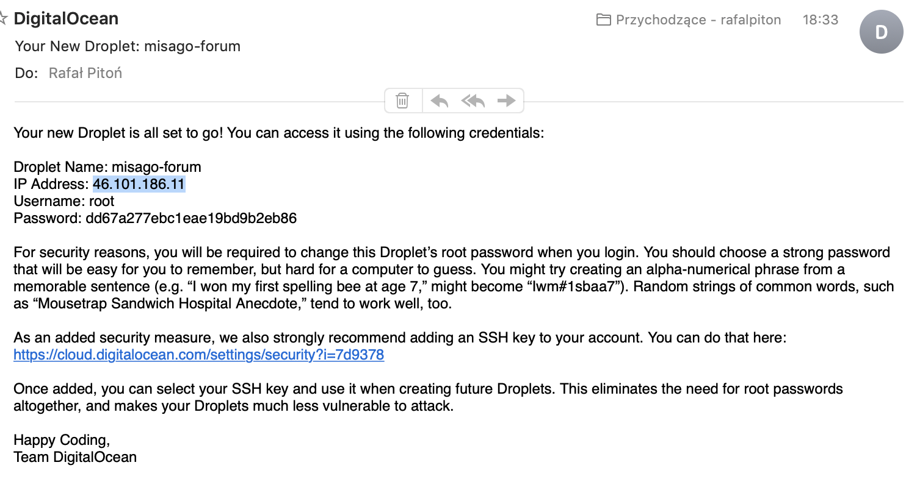
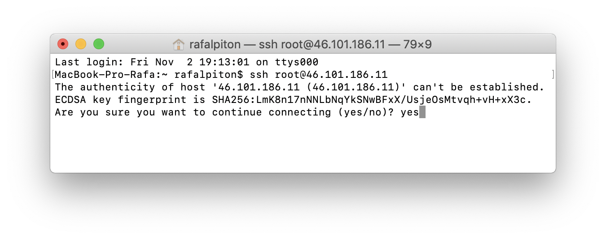
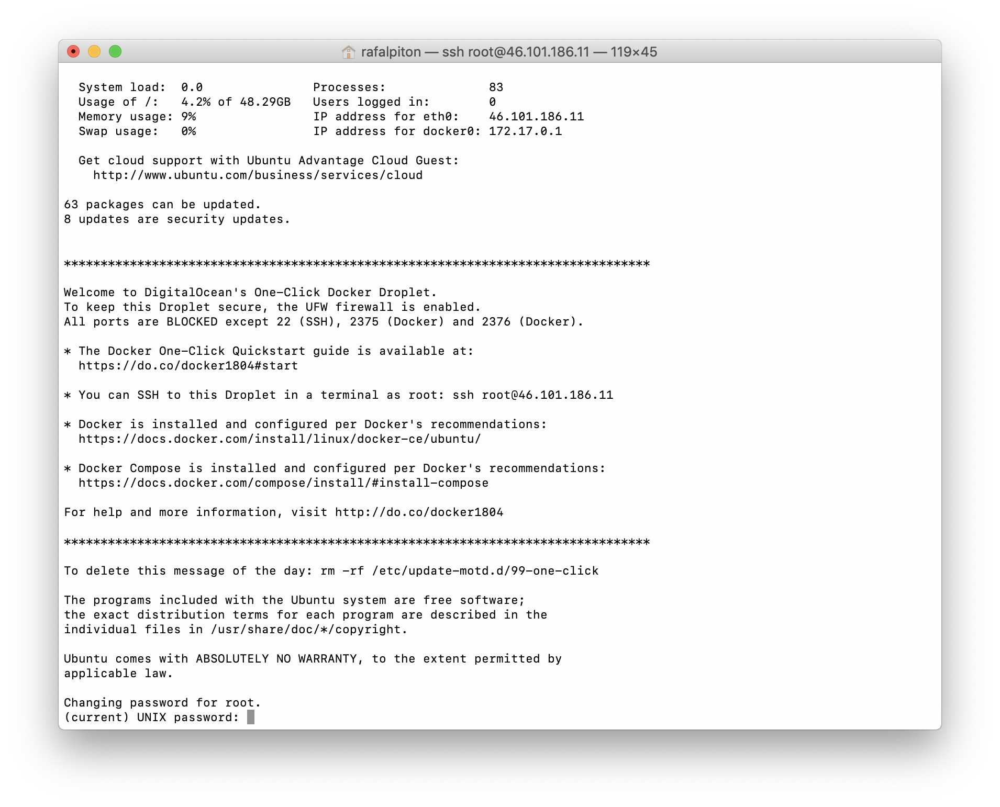
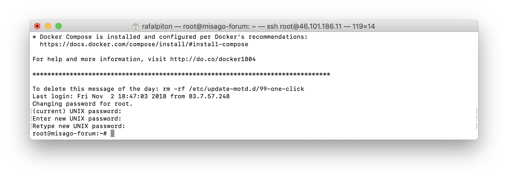
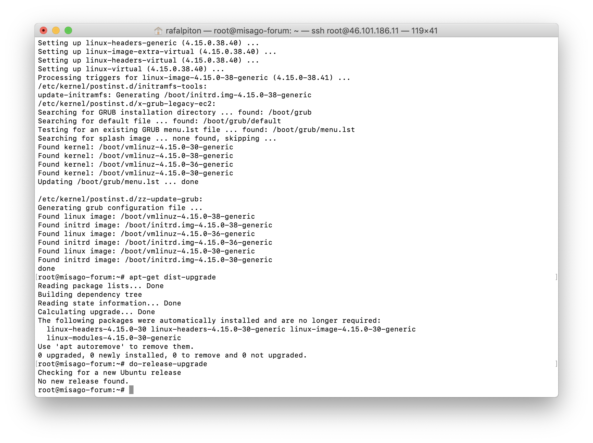
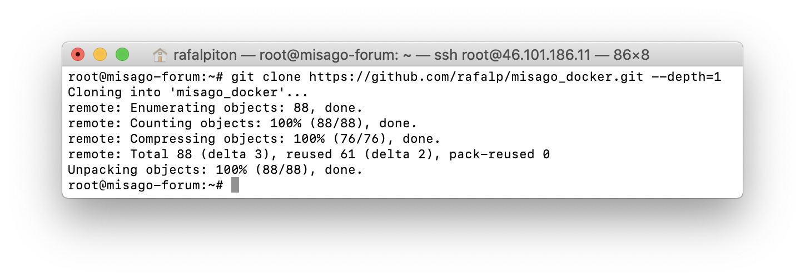
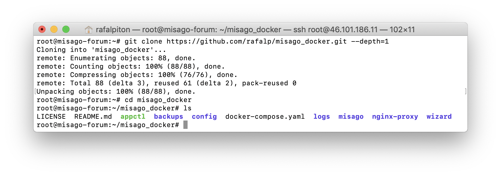
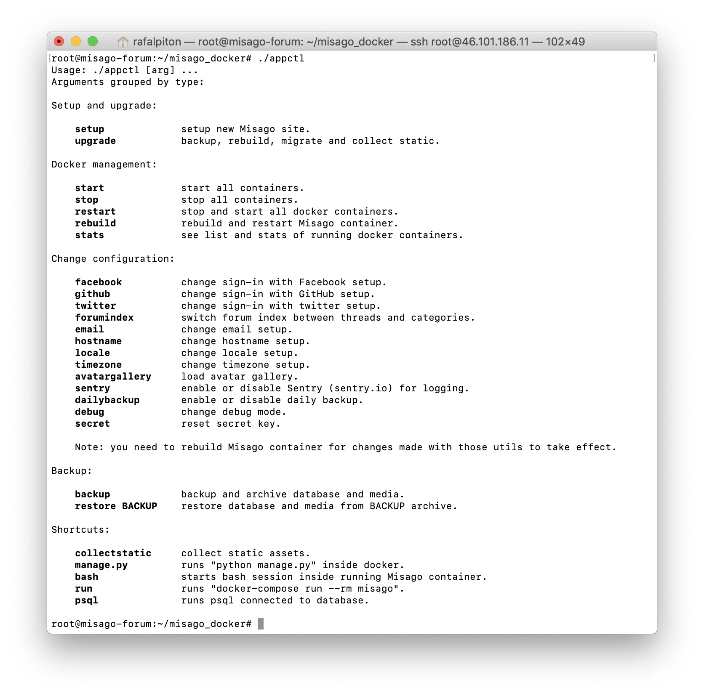

Setup Misago on your Server
===========================

In previous guides we [created server on Digital Ocean](./Server.md) and [configured domain](./Domain.md).

We are finally ready to setup Misago!

Getting on the server
---------------------

Do you remember this email from server setup guide?

It contains three bits of information that we will use to get on server and setup Misago:

- IP address
- Username
- Password

If you are on Linux or Mac, you are ready to continue. If you are on Windows, you will first need to install SSH client. Digital Ocean has guide for Windows connecting to droplet using PuTTy [here](https://www.digitalocean.com/docs/droplets/how-to/connect-with-ssh/putty/).

*nix-like systems already implement program for connecting to server. Open your terminal and run following command, replacing the part after `@` with your droplet's IP address:

    ssh root@ip-addres

After running this command, your terminal will attempt to connect to your droplet using `root` username. Because this will be first connection to unknown server, you will be asked if you are sure. Confirm by entering `yes` and pressing enter:

You will now be asked for password. Use one you've received in e-mail from Digital Ocean and confirm with enter. Log in should complete and you should see welcome message from your server:

As you see at bottom of message, you are now forced to enter **current** password, and then **new** password. "root" is special user that can do **EVERYTHING** on the server so make sure you use LONG password for it. I've used password manager to generate 64 characters long password:

You can now use your new password to log in your server as root.

Updating server software
------------------------

You are now connected to your server as "root" user. Digital Ocean is nice enough to do plenty of configuration on server for us, but just to be safe, we should do update.

We can do that running bunch of commands. If any of commands asks you if you wish to continue, confirm that by typing "y" and pressing "enter". If updater warns you that one of files to be updated would overwrite locally modified file, select "keep the local version currently installed" choice.

Commands to run are following:

    1. `apt-get update`
    2. `apt-get upgrade`
    3. `apt-get dist-upgrade`
    4. `do-release-upgrade`

Enable brute-force protection
-----------------------------

Internet is patrolled by bots trying to brute-force "root" user passwords for found servers. In addition to setting long and hard to guess password for "root", we can also enable mechanism that will ban IP address from logging to server for 10 minutes, if they failed to enter correct password three times.

To do that run following command:

    apt-get install fail2ban

If you are asked for confirmation, continue like in previous step.

Downloading Misago on the server
--------------------------------

Run following command:

    git clone https://github.com/rafalp/misago_docker.git --depth=1

This will download latest version of Misago from [GitHub](https://github.com/rafalp/misago_docker) to `misago_docker` directory:

Run `cd misago_docker` command to enter directory containing our Misago site. You can "look around" the directory you are currently in using `ls` command:

We see that bunch of files and directories have been downloaded, including `LICENSE`, `appctl`, `backups`, `logs`, and more. Your list may be different depending on changes happening in new Misago versions.

Running Misago setup
--------------------

One item on the list stands out more than the rest: `appctl`.

This is executable script that Misago provides for administrators to make it easier to setup and manage Misago sites.

To run it, enter `./appctl`. This will result in list of available options being displayed:

We see that we can use `setup` option to setup new Misago site. To use option, run `./appctl` followed with option's name:
    
    ./appctl setup

You will be asked to enter hostname for your site. Enter domain name you have pointed at the server and confirm with enter.

> **Note:** You may remember that in domain guide we have created two records for our domain: one without "www" and other with. Enter either of those. Misago will create 301 redirection from other domain to make sure there are no duplicate-content problems with links to your site.

Next, enter e-mail address for [Let's encrypt](https://letsencrypt.org/) certificate. Misago uses Let's Encrypt service to secure your users connections with your site. It is 100% free, safe and GDPR compliant, but Let's Encrypt requires your e-mail address in order to be able to contact you in case something wrong is happening with your HTTPS certificate.

You will be also asked to enter language code for your site's locale. Locale affects language of site's interface and search engine accuracy. List of all locales can be found [here](../Locales.md).

> **Note:** You can always change your answers later using dedicated option in `./appctl`.

Continue answering the questions until you get asked if you want to initialize default database. Confirm this with "Y", and grab cup of coffee as installer does its magic.

Eventually you will be asked to enter username, email and password for your superuser account. Make sure you'll remember those inputs. At start this will be only user on your site with access to admin control panel.

After user is created, setup will perform few more actions before finally displaying "setup completed" message. You should now be able to visit your site and log in to your account using the credentials you've entered during the setup. 

If your browser informs you that there is an HTTPS error on your side, wait few minutes and try again. If your site is still missing HTTPS after few minutes, it may be that you have hit the [limit of number](https://letsencrypt.org/docs/rate-limits/) of certificates that Let's Encrypt may issue for single domain in the week.

Lastly, visit `yourdomain.com/admincp/` in your browser and log in to admin control panel to setup site name, categories and such.

-----

Next guide: [Upgrading your Misago to latest version](./Upgrading.md)