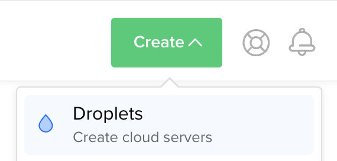
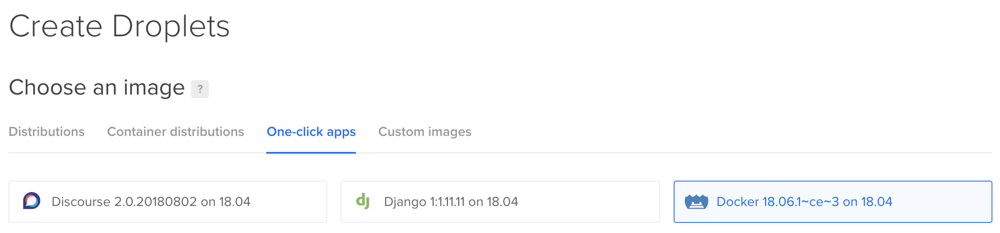
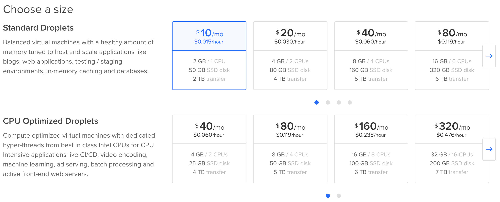
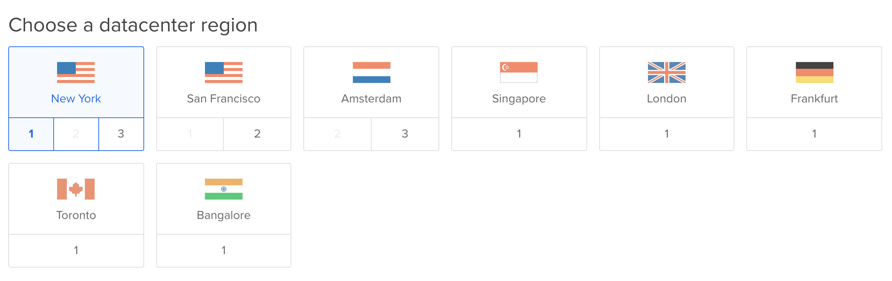
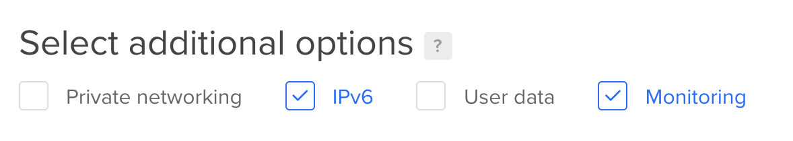
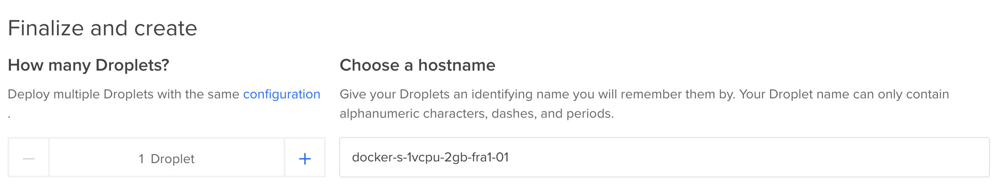
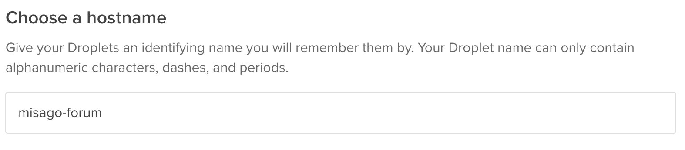
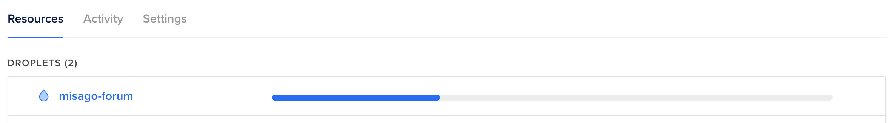
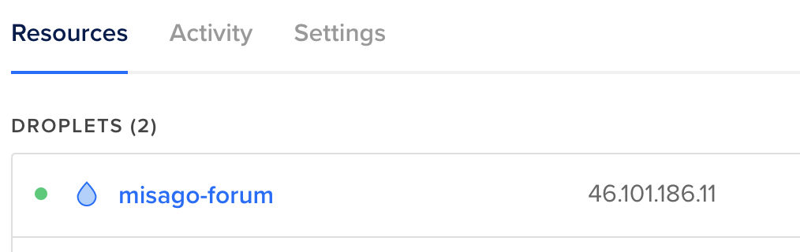

Create server on Digital Ocean
==============================

Misago requires a server with at least 2GB of memory to work. At first this may sound excessive, but unlike shared hosting providers where memory usage is tracked per app, on VPS every single program running on your will add to the limit.

The good news is that 2GB of memory is enough for even larger and active Misago communities, so you will not have to worry about hosting costs growing any time soon.

Creating the server
-------------------

Go to [Digital Ocean](https://m.do.co/c/a8c85735320a) website. Sign up if you don't have account or login if you do.

You will now see DO's cloud management panel. Click the green "Create" button and pick "Droplets":

If this is first time seeting the name "Droplet", don't be confused: it' just a Digital Ocean name for "server in the cloud".

Picking droplet image
---------------------

You will be asked what image to use to create your droplet. Under "Choose an image" select "One-click apps" and then "Docker":

Note that version numbers after "Docker" may differ from ones on screenshot. This is okay. First version stands for docker version. "ce" means Community Edition. "on 18.04" means that OS will be Ubuntu 18.04. 

Droplet size
------------

Next, move to "Choose a size" - there will be quite a few available, and Digital Ocean may suggest the "$40" "Standard droplet". Pick the $10 droplet that gives 1 CPU and 2 GM of memory instead:

Why not pick one of "CPU Optimized Droplets"? Those give you much more CPU power than standard ones, but majority of web applications don't do anything that requires a lot of CPU power. Instead, they receive HTTP connections, execute simple and short-lived tasks, read some data from database, put together html document and send it back to user. Likely the heaviest lifting your site will do will be generating thumbnails for user-posted images, but that will not be happening non-stop, and still is far less intensive than, say, encoding 1.5tb video files for streaming.

Choose a region
---------------

Scroll page to "Choose a datacenter region". You will see a list of flags and region names:

Sadly, there is no "right" choice here. As rule of thumb the closer the site is located to the users, the faster it *should* load for them.

For example, picking Frankfurt, Amsterdam or London should guarantee best response times for people in Europe, but site may take little longer for users from US or Asia. Likewise picking Singapore or Bangalore should be better if your users will be coming primarly from Asia. My site will be directed to users from Poland, so I'll pick Frankfurt for region.

Additional options
------------------

After picking region, next one will be "additional options". Here we will select IPv6 and Monitoring. The former choice enables use of IPv6 addressing for droplet (but doesn't mean it will be assigned IPv6), and latter will allow you to later monitor your server from Digital Ocean cloud panel:

Finalize and create droplet
---------------------------

Final step for Droplet creation is selecting how many droplets we wish to create, and how those should be identified:

Make sure droplet count is showing "1 Droplet". Customizing "hostname" is optional, but will make it easier to recognize your droplet in Digital Ocean panel, so I've decided to change mine to `misago-forum`:

Lastly, click the large "Create" button at the bottom of the page. You will be taken back to your dashboard, where you will see your droplet on "Droplets" list:

When droplet creation finishes, the progress bar will be replaced with IP address assigned to it:

You will also receive an e-mail with access credentials for your droplet:

-----

Next guide: [Point domain at your server](./Domain.md)